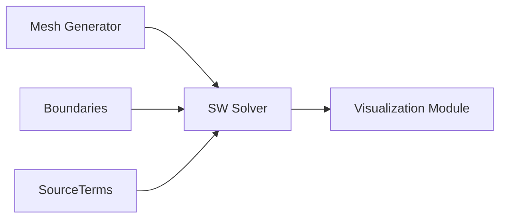
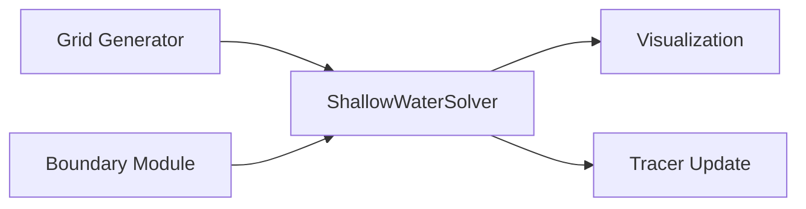
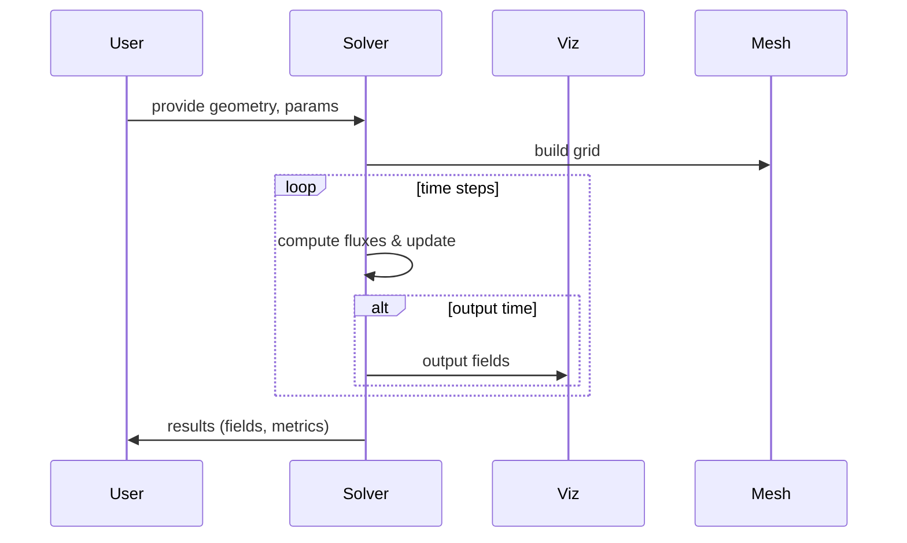

# Version 0.1 Mathematical Architecture Specification: 2D Basin Simulator (Hydraulic Sandbox)

**Executive Summary:** We develop a minimal yet robust 2D depth-averaged numerical model for rectangular flocculation/sedimentation basins.  Version 0.1 focuses on **hydrodynamics only** (a “sand-box” solver for flow and geometry scenarios).  Governing equations are the 2D shallow-water (Saint-Venant) continuity and momentum equations under hydrostatic, incompressible assumptions【32†L44-L46】, with a simple optional tracer (advection–diffusion) and settling proxy.  A structured Cartesian grid (cell size ~0.25–1.0 m) is used, with refinement near inlets, outlets, and baffles.  An explicit finite-volume solver (Godunov-type) advances the solution in time under a CFL-limited timestep (steady/quasi-steady solution via iterative convergence).  Internal baffles are represented via adjusted fluxes: solid baffles as impermeable internal boundaries, perforated baffles or partial-depth baffles via reduced effective area or momentum-sink terms.  Boundaries are treated as specified inflow discharge or velocity, broad-crested weir at outlet, and no-flow walls.  We include pseudocode outlining mesh setup, time-stepping loop, flux calculation (e.g. HLL/HLLC), and data structures (NumPy arrays).  Validation tests include simple dam-break or uniform flow cases and tracer washout tests.  Target runtimes are on the order of seconds–minutes per scenario on a modern laptop.  The focus is on **transparency, clarity, and minimal complexity** needed for operator insight, not high-order accuracy or full CFD detail.  All key assumptions (hydrostatic, single layer, no vertical structure) are stated, and neglected effects (3D turbulence, stratification, full solids population balance) are acknowledged.  The following sections detail each component.

## 1. Governing Equations (2D SWE, Tracer, Settling)

- **Continuity (volume conservation):**  Under the hydrostatic, incompressible assumption the 2D depth-averaged continuity equation is 
  \[
     \frac{\partial h}{\partial t} + \frac{\partial (hu)}{\partial x} + \frac{\partial (hv)}{\partial y} = q(x,y,t) ,
  \] 
  where \(h(x,y,t)\) is water depth, \((u,v)\) depth-averaged velocities, and \(q\) any lateral inflow/outflow (e.g. from mixers or drains)【32†L44-L46】【13†L394-L399】.  In most sedimentation basin scenarios \(q\) can be set to zero except for known point flows.  We typically set \(q=0\) and specify total discharge via boundary conditions.  Equation form can also use surface elevation \(\eta\) if a fixed downstream depth is given; HEC-RAS notation uses \(\partial \eta/\partial t + \nabla\!\cdot(h\mathbf{V})=q\)【32†L44-L46】, which is equivalent when bed elevation is constant.  **Assumptions:** constant density (no buoyancy stratification), hydrostatic pressure, no vertical acceleration, flat rigid bed (no bed evolution). Neglected effects include vertical variations, free-surface curvature, and non-hydrostatic pressures.

- **Momentum (Saint-Venant):** The depth-averaged momentum equations (vector form) are: 
  \[
  \frac{\partial (h\mathbf{V})}{\partial t} + \nabla \cdot\bigl(h\mathbf{V}\otimes\mathbf{V} + \tfrac12 g h^2 \mathbf{I}\bigr) 
  = -g h\,\nabla z_b - g h\,\nabla \eta_{\rm ext} - \mathbf{F}_f ,
  \] 
  where \(\mathbf{V}=(u,v)\), \(g\) gravity, \(z_b\) bed elevation (zero if datum), \(\eta_{\rm ext}\) any external water surface (we often set this to 0 or a reference), and \(\mathbf{F}_f\) friction/drag forces.  In practice one implements the momentum eqn as separate x- and y-components:
  \[
     \frac{\partial (hu)}{\partial t} + \frac{\partial}{\partial x}(hu^2 + \tfrac12gh^2) + \frac{\partial (huv)}{\partial y} = -gh\frac{\partial z_b}{\partial x} - \tau_{bx}, 
  \]
  \[
     \frac{\partial (hv)}{\partial t} + \frac{\partial(huv)}{\partial x} + \frac{\partial}{\partial y}(hv^2 + \tfrac12gh^2) = -gh\frac{\partial z_b}{\partial y} - \tau_{by},
  \] 
  where \(\tau_{bx}, \tau_{by}\) are the depth-averaged bed shear stresses.  One common form is **Manning’s formula**: 
  \(\|\tau_b\| = \rho g n^2 \|\mathbf{V}\|^2 / h^{4/3}\), giving \(\tau_{bx} = \rho g n^2 \,u\sqrt{u^2+v^2}/h^{4/3}\), and similarly for \(\tau_{by}\).  In HEC notation, the bottom shear is \(\tau_b = \rho C_d |V|^2\), with \(C_d = g n^2/R^{1/3}\)【32†L73-L77】 (for hydraulically rough flow, \(R\approx h\)).  We will implement a simple friction term via a Manning \(n\) coefficient.  **Neglected physics:** No turbulence closures (apart from simple eddy-viscosity if desired), no Coriolis (irrelevant at this scale), no non-Newtonian sediment-stress (assumed “clear water”).  The term \(-gh\nabla z_b\) can represent any static bed slope (often zero); for flat basins we set \(z_b=0\).

- **Passive Tracer/Concentration:**  To probe short-circuiting and mixing we include a tracer equation for a dye or turbidity parameter \(\phi(x,y,t)\).  In depth-averaged form:
  \[
    \frac{\partial (h\phi)}{\partial t} + \nabla\cdot(h\mathbf{V}\,\phi) = \nabla\cdot (h \mathbf{D}\,\nabla \phi) - w_s h\phi \;,
  \]
  where \(\mathbf{D}\) is a diffusion tensor (we may take scalar horizontal diffusivity \(D\) or small eddy-viscosity) and \(w_s\) an effective settling velocity.  Expanding, \(\phi\) is volume concentration (kg/m³).  If diffusion is isotropic, \(\nabla\cdot(h D\nabla\phi)\) can be discretized by second-order central differences.  The sinking term \(-w_s h \phi\) removes tracer uniformly to mimic settling (to be used in a later version).  For a simple “tracer test,” one may ignore settling (\(w_s=0\)) and set \(\phi=1\) in a small region, then monitor its washout.  Equation (3) in the Omega shallow-water doc【13†L394-L399】 is analogous (with higher-order diffusion).

**Key Assumptions & Neglected Physics:**  Single-layer (no vertical stratification), hydrostatic pressure, flat rigid bed, no vegetation or weir losses (except outlet), no sediment-back effect on flow.  We neglect vertical velocity profiles, thermal density currents, flocculation kinetics, and detailed population balance.  This minimal physics is deliberate: it captures bulk flow paths and mixing, which largely govern operator-level decisions. 

## 2. Grid and Mesh Generation

- **Grid Type:**  Use a **structured Cartesian grid** covering the rectangular basin footprint.  A typical basin might be \(20\)–\(50\) m long and \(5\)–\(15\) m wide.  Discretize into square or rectangular cells with side \(\Delta x\), \(\Delta y\).  We recommend \(\Delta x\approx 0.25\)–\(1.0\) m depending on basin size and feature density (finer for complex baffle layouts, coarser for simple flow patterns).  At least 20–40 cells in the length direction and similar in width is a good starting grid to capture recirculation zones. 

- **Refinement:**  Locally refine cells near **key features**: 
  - **Inlets/outlets:** small cells (\(\Delta\approx 0.25\) m) to resolve jets and shear layers.  
  - **Baffles:** refine at baffle locations so that a baffle spans multiple cells (e.g. 5–10 cells long). If baffles are thin, one may place cell boundaries along them.  
  - **Depth variation (if any):** e.g. if drawing a solid baffle, align cells with its edge.  

  Refinement can be achieved by halving the grid spacing in subregions. For simplicity, we can restrict to one or two levels of uniform refinement; full adaptive mesh is not needed for V0.1.  The result is a logically rectangular grid (though possibly with more cells in one region).  

- **Indexing and Data Structures:**  Number cells by indices \(i=1,\dots,N_x\), \(j=1,\dots,N_y\).  Store arrays for depth `h[i,j]`, velocities `u[i,j]`, `v[i,j]`, tracer `phi[i,j]`.  Optionally store bed elevation `zb[i,j]` (zero for flat).  Use ghost cells around the perimeter (one layer outside the basin domain) to implement boundary conditions.  In Python/NumPy, one can allocate arrays of size \((N_x+2)\times(N_y+2)\).  Typically, index `(i,j)` refers to cell center at coordinates `x = (i-0.5)*dx`, `y = (j-0.5)*dy` if using cell-centered storage.  Alternatively, a staggering (Arakawa C-grid) could be used, but for clarity we use a fully cell-centered scheme with fluxes on faces.

- **Baffles in Grid:**  Represent baffles by aligning cell edges with them if possible.  A solid baffle is an *internal boundary*: e.g. if a vertical baffle runs from north to south at x=k*Δx, then no-flow across the interface between cells \((k,j)\) and \((k+1,j)\).  For a slanted or perforated baffle, one approach is to adjust fluxes as described below (Section 5).

```text
ASCII Schematic (plan view of a simple basin with one central baffle):
+-----------------------------+
|                            | 
| Inflow ->  |====Baffle====| -> Outflow
| (Left side)|  (partial h)  |(Right side)
|            |              |
+-----------------------------+
```

## 3. Time-Stepping and Stability

- **Quasi-Steady Approach (V0.1):**  We allow transient solution but primarily iterate until **steady or quasi-steady** state.  In practice, we apply a small time step (see CFL below) and advance in time until residuals (mass change per step) fall below a tolerance (e.g. <0.1% change in depth or flux).  This mimics solving the steady shallow-water equations without having to invert large matrices.

- **Explicit vs Implicit:**  For simplicity we choose an **explicit time-marching scheme** (e.g. forward Euler or a two-stage Runge-Kutta).  This avoids solving linear systems but requires small timesteps for stability.  Implicit methods (Crank–Nicolson) are possible but more complex (matrix solves) and not needed for a sandbox.  We adopt a **CFL-limited dt**: 
  \[
     \Delta t \le \mathrm{CFL} \cdot \min\!\Bigl(\frac{\Delta x}{|u|+c},\,\frac{\Delta y}{|v|+c}\Bigr),
  \] 
  where \(c=\sqrt{gh}\) is the gravity wave speed.  For example, take CFL = 0.5–0.9 for stability (1.0 is marginal).  With \(\Delta x=0.5\) m, \(h\approx1\) m, \(c\approx3.1\) m/s, a conservative dt is \(\Delta t\approx0.1\) s.  This ensures numeric stability and monotonic wave propagation.  

- **Timestep Selection:**  We can fix dt based on the **maximum expected depth/velocity** in the basin.  If peak velocity is small (e.g. <0.5 m/s), dt can be larger; if jets occur, dt shrinks.  A practical strategy is to compute the local wave speed each time step and apply dt dynamically.  For code simplicity, one may choose a constant dt (e.g. 0.01–0.1 s) that satisfies CFL with a margin.  Overall, expect **thousands of steps** to reach steady state for a large basin scenario.

- **Time Loop Pseudocode:**
  ```python
  initialize h[i,j], u[i,j], v[i,j], phi[i,j]
  t = 0
  while (t < t_end) or (not converged):
      apply_boundary_conditions(h,u,v) 
      compute_fluxes_and_sources() 
      update_huv()        # explicit update: h_new = h_old - dt*div(flux)
      update_tracer()     # if included
      t += dt
      check_convergence()
  ```
  Here `compute_fluxes_and_sources()` calculates fluxes at each cell face and any source terms (friction).  The loop continues until a steady pattern emerges or a maximum time is reached.  For V0.1, one may simply iterate until ∆h changes by <1% per step.

- **Stability Tradeoffs:**  Explicit schemes are easy to code and parallelize, but require small dt.  If needed, one could use an **IMEX** approach (implicit terms for gravity waves, explicit for advection), but that is overkill here.  A second-order Runge–Kutta (RK2) may be used for improved accuracy, but the simplest forward Euler is acceptable for a first implementation (with the understanding that diffusion will dominate error). 

## 4. Numerical Discretization

- **Finite-Volume Discretization:**  We integrate the shallow-water PDEs over each cell.  The update for cell \((i,j)\) is:
  \[
    h_{i,j}^{n+1} = h_{i,j}^n - \frac{\Delta t}{\Delta x}\bigl[F_{i+\frac12,j}^{x} - F_{i-\frac12,j}^{x}\bigr] - \frac{\Delta t}{\Delta y}\bigl[F_{i,j+\frac12}^{y} - F_{i,j-\frac12}^{y}\bigr] + \Delta t\,q_{i,j},
  \]
  and similarly for \(hu\) and \(hv\).  Here \(F^x_{i+1/2,j}\) is the numerical flux through the right face, and \(F^y_{i,j+1/2}\) through the top face.  To achieve stability, we use an **upwind (Godunov) flux**.  A common choice is the HLL or HLLC Riemann solver which solves an approximate 1D Riemann problem normal to the face【13†L389-L395】.  At each face, reconstruct left/right states (e.g. piecewise linear with a slope limiter), then compute fluxes.  

- **Reconstruction and Slope Limiters:**  We may use a second-order MUSCL scheme: approximate values at face centers by linear reconstruction of cell values with a limiter (minmod or van Leer) to prevent overshoots.  For example, 
  \[
    U_{i+\frac12}^L = U_{i,j} + \frac12\phi(\theta)\,(U_{i,j}-U_{i-1,j}),\quad
    U_{i+\frac12}^R = U_{i+1,j} - \frac12\phi(\theta)\,(U_{i+2,j}-U_{i+1,j}),
  \]
  where \(\phi\) is a limiter function (minmod, superbee, etc.).  Implementing limiters adds complexity but avoids spurious oscillations at sharp gradients (e.g. jets).  For a first prototype, even a first-order upwind (no limiter) can be acceptable but will smear eddies.

- **Flux Calculation:**  The **HLLC flux** for shallow water ensures well-behaved wet/dry and contact waves (it preserves water height positivity).  However, one may start with the simpler HLL (two-wave) solver or even Lax-Friedrichs.  At face between cells \(L\) and \(R\), compute wave speeds \(S_L\), \(S_R\) based on characteristic speeds \(u\pm c\), then set 
  \[
    F_{\rm HLL} = \frac{S_R F_L - S_L F_R + S_L S_R (U_R - U_L)}{S_R - S_L},
  \]
  where \(U=[h,hu,hv]\), \(F=[hu, hu^2+\tfrac12gh^2, huv]\) (in x-direction, similarly for y).  This is standard (see Toro’s methods).  HLLC adds a middle wave to restore tangential velocity continuity.

- **Diffusive Terms:**  If we include horizontal diffusion (for tracer or momentum mixing), discretize using central differences.  For example, a Laplacian term \(\nu \nabla^2(h u)\) is approximated by \(\nu [(h u)_{i+1,j} - 2(h u)_{i,j} + (h u)_{i-1,j}]/\Delta x^2\) (plus similar in y).  This could be added as an explicit source after computing flux updates.

- **Slope Limiters:**  To implement one of the Total Variation Diminishing (TVD) limiters (minmod, van Leer, etc.), see standard CFD textbooks.  For brevity, we may implement a simple minmod:
  \[
    \phi_{\rm minmod}(r) = \max(0,\min(1,r)), 
  \]
  with \(r=(U_{i}-U_{i-1})/(U_{i+1}-U_i)\).  This prevents new extrema.  Using a limiter is not strictly necessary for a smooth basin flow (no shocks), but it can help handle any steep gradients.

- **Numerical Comparisons (Example Table):**

  | Scheme                 | Order | Stability/CFL           | Accuracy   | Notes                                |
  |------------------------|:-----:|:-----------------------:|:----------:|--------------------------------------|
  | **First-order upwind** | 1     | CFL ≤ 1 (strict)        | Low        | Very diffusive, simple flux (LF)     |
  | **Second-order HLL**   | 2     | CFL ~ 0.7–0.9           | Moderate   | Good shock capture, moderate effort  |
  | **HLLC (2nd order)**   | 2     | CFL ~ 0.7–0.9           | High       | Captures contacts, more complex      |
  | **Implicit (CN)**      | 2     | Unconditionally stable*  | High       | Larger timesteps, needs solver       |

  * Crank–Nicholson is unconditionally stable for linear advection, but coupling with nonlinear fluxes means practical limits still apply.

## 5. Boundary Conditions

- **Inflow Boundary (Channel or Pipe Inlet):**  At an inlet (e.g. left wall), we prescribe either a **discharge \(Q\)** or a **velocity profile**.  In a 2D model, one may simply set the normal velocity on the inlet cells.  For example, if \(Q\) is given, set \(u_{\rm inlet} = Q/(h_{\rm inlet} \cdot L_y)\) uniformly (where \(L_y\) is inlet width).  In code, one can fix ghost-cell values or directly impose the flux \(F^x_{i-1/2,j} = Q/N_j\) into the finite-volume update.

- **Outlet Weir/Launder:**  If the outlet is a broad-crested weir or launder, we relate surface elevation to flow.  A simple approach: set a downstream stage \(h_{\rm out}\) (e.g. a small tailwater depth) and compute outflow via \(Q = C_w L (2g)^{1/2} h_{\rm weir}^{3/2}\) (if submerged).  In a cellular sense, one can fix \(h\) on the outlet ghost cells to the desired level, then let the model compute outflow.  Alternatively, do not fix velocity, but use a **radiation (open) condition**: copy values from adjacent interior cells (zero-gradient) and let waves exit freely.  For simplicity, one can treat the outlet as a “thick weir”: set \(\eta_{\rm out}=0\) and allow velocity out by the shallow-water equation itself.  One can also add a small friction or headloss to mimic the weir.

- **Walls:**  Solid side walls (and bottom, if 3D) are **impermeable**: normal velocity = 0.  In practice, set ghost cell velocities so that \(u_{\rm ghost} = -u_{\rm interior}\) (reflective) or simply zero normal component.  The simplest: for a wall at \(x=0\), set \(u_{0,j}=0\) and \(v_{0,j}=v_{1,j}\) (mirror tangential velocity).  Similarly at the top/bottom.

- **Internal Baffles:**  
  - **Solid (impermeable) baffle:** Treat as an internal wall.  Identify the cell face(s) along the baffle, and enforce zero-normal-flux across them.  Numerically, set the flux there to zero and ensure ghost cells on the blocked side carry reflected states.  In effect, split the domain into two subdomains.
  - **Perforated or porous baffle:**  If the baffle has orifices, one can simulate it by adding a **momentum sink**: subtract \(\Delta \mathbf{V}\) across the baffle proportional to velocity.  For example, apply a Darcy-like or orifice equation: \(\Delta u = -C_f u|u|\), where \(C_f\) is chosen to yield the desired pressure drop.  This can be done by treating the baffle face like a rough porous medium.  In code, one may modify the HLL flux by multiplying by an open-area fraction \(a_f<1\).  
  - **Curtain (partial-height) baffle:**  In 2D depth-averaged model we cannot simulate partial depth directly.  A common trick: **reduce the cell’s effective depth** or area.  For example, if a baffle extends half the depth, then in cells containing it we treat only 50% of the flow area as open.  Concretely, set an “open fraction” \(f_o\) in the cells across the baffle (e.g. \(f_o=0.5\)).  When computing fluxes across that line, multiply flux by \(f_o\).  This approximates the blockage effect without vertical resolution.  It is admittedly heuristic but often used.  
  - **Guiding vanes:**  Similar to partial baffles, but may be angled.  These may be modeled as velocity-deflecting features: after computing flux, rotate the velocity vector by some angle or impose a tangential component.  For V0.1, skip complex vane geometry.

  **Table: Baffle Representation Trade-offs**

  | Baffle Type     | Representation                   | Pros                           | Cons                       |
  |-----------------|----------------------------------|--------------------------------|----------------------------|
  | Solid wall      | Internal no-flow boundary        | Simple, exact blockage         | Overestimates drag if porous |
  | Perforated wall | Momentum sink (Cf or open frac)  | Mimics energy loss/open area   | Needs calibration of Cf    |
  | Partial-depth   | Reduced open area fraction       | Simulates partial block        | Approximate (neglect vertical shear) |
  | Guide vanes     | Velocity deflection (turn angle) | Captures directional control   | Complex to implement       |

## 6. Tracer/Settling Proxy (Depth-Averaged)

- **Tracer Advection–Diffusion:**  As above, after updating velocities we advect a passive tracer concentration \(\phi\) using the same fluxes: 
  \[
    \frac{\partial (h\phi)}{\partial t} + \frac{\partial (h u \phi)}{\partial x} + \frac{\partial (h v \phi)}{\partial y} = \frac{\partial}{\partial x}\Bigl(h D\frac{\partial \phi}{\partial x}\Bigr) + \frac{\partial}{\partial y}\Bigl(h D\frac{\partial \phi}{\partial y}\Bigr).
  \]
  Discretize similarly by finite volumes: convective flux \(h u \phi\) on faces (use same Riemann solver with states \(\phi_L,\phi_R\)), and diffusive flux \(-hD\,\partial \phi/\partial x\) by centered differences.  This yields the tracer field over time.  

- **Settling Sink:**  To approximate sediment settling without full 3D, introduce a simple sink term \(-w_s \phi\).  For example, after each advective update multiply \(\phi\) by \(\exp(-w_s \Delta t/h)\).  This lumps particles out of suspension at a uniform rate \(w_s\).  For Version 0.1, you may set \(w_s=0\) (no settling) or a constant (0.001–0.01 m/s for flocs).  

- **Performance Metrics:**  From the tracer, compute indicators:
  - **Breakthrough Curve:** Introduce a tracer pulse upstream and track its concentration at the outlet.  Plot \(C_{\rm out}(t)\) vs time to gauge short-circuiting and mixing.  
  - **Residence-Time Distribution (RTD):** The shape of outlet concentration over time provides an RTD; compare to ideal plug-flow or tanks-in-series.  
  - **Capture Efficiency Proxy:** After a fixed simulation time, compute total tracer mass leaving vs entering.  For settling, compute fraction settled: \(\eta = 1 - \frac{\int_{\rm outlet} h\phi\,dA}{\int_{\rm inlet} h\phi\,dA}\).  This approximates turbidity removal.  

These simple proxies help translate flow fields into actionable outcomes (e.g. “we expect 95% solids removal”).

## 7. Numerical Stability and Convergence

- **CFL Check:**  After each step compute \(\text{CFL} = \max_{i,j}(|u_{i,j}|+c_{i,j}) \Delta t/\min(\Delta x,\Delta y)\).  Ensure CFL ≤ 1.  If exceeded, reduce dt.  

- **Convergence:**  Monitor changes \(\Delta h_{i,j} = h_{i,j}^{n+1}-h_{i,j}^n\) or mass residual.  Declare convergence when \(\max|\Delta h/h|\) < tolerance (e.g. 10⁻³).  Also verify total mass conservation (if no sources) remains constant (modulo numerical round-off).  

- **Mesh Sensitivity:**  Run a simulation with two grid resolutions (e.g. 1.0 m and 0.5 m cells).  Key comparisons: velocity field patterns and outlet tracer curves should not qualitatively change.  If results differ significantly, refine mesh or time step.  Plotting profiles of velocity or tracer along a transect (e.g. outlet) is a good check.

- **Stability Tips:**  Avoid extremely small h (wet–dry issues) by imposing a minimum depth (e.g. \(h_{\min}=1e\!-\!3\) m).  Use shallow-water “HLLC positivity” fixes if needed (e.g. ensure \(h>0\) after update).  Slope limiters also help prevent instabilities.

## 8. Implementation Architecture (Python)

- **Modules/Workflow:**  A modular Python design using **NumPy/SciPy** is recommended.  A possible module breakdown:
  1. **Mesh Generator:** Reads basin geometry (e.g. from a simple JSON or hard-coded shape) and creates arrays of coordinates and boundary flags.  
  2. **State Variables:** Holds arrays `h, hu, hv, phi`.  
  3. **Boundary Conditions Module:** Functions to apply wall/inlet/outlet conditions to ghost cells each step.  
  4. **Flux Solver:** Core routines to compute numerical fluxes (HLL/HLLC) in x- and y-directions.  This includes reconstruction (linear slopes) and solving Riemann problems.  
  5. **Time Stepping:** Manages the loop, calls flux solver, updates states, and applies source terms (bed friction, diffusion).  
  6. **Output/Visualization:** Writes intermediate data (e.g. every N steps) and produces plots with Matplotlib or Plotly (contour maps of depth, velocity vectors, tracer fields).  



- **Pseudocode Outline:**  

  ```python
  # Initialization
  mesh = generate_mesh(basin_geometry)
  h = np.ones((Nx+2,N_y+2))*h0   # initial depth
  u = v = phi = np.zeros_like(h)
  for (i,j) in inlet_cells:
      u[i,j] = Qinlet / (h[i,j]*dy)  # set initial inflow
  t = 0; iter=0

  # Main time loop
  while t < T_max and not converged:
      apply_bc(h,u,v)
      # Compute face-centered fluxes
      for each interior face:
          reconstruct left, right states (h,u,v)
          compute HLLC flux F_x, F_y
      # Update conserved variables
      for each cell (i,j):
          h[i,j] -= dt*( (F_x[i+1/2,j]-F_x[i-1/2,j])/dx + (F_y[i,j+1/2]-F_y[i,j-1/2])/dy )
          hu[i,j] -= dt*( ...similar for momentum fluxes... ) + dt*( -gh*dzdx - tau_x )
          hv[i,j] -= dt*( ... ) + dt*( -gh*dzdy - tau_y )
      # Optional tracer update (advection + diffusion)
      phi = update_tracer(phi, h, u, v, dt)
      t += dt; iter += 1
      check_convergence()
  ```
  Key libraries: **NumPy** for arrays, **SciPy** for any linear algebra (if implicit needed later).  For speed, one may decorate flux loops with **Numba** (just-in-time compilation).  Mesh I/O can be as simple as reading coordinates from a file (e.g. JSON or CSV), or using **Gmsh**/GeoJSON with PyVista for more complex shapes.  For plotting, use Matplotlib’s `pcolormesh` or Plotly’s contour for depth/tracer and quiver for velocity.  

## 9. Validation and Benchmark Cases

- **Steady Uniform Flow:**  Check that a uniform flow (constant \(h,u\)) remains steady.  E.g., set \(h=1\) m, \(u=0.1\) m/s everywhere, no source/sink; the solution should not change.  This verifies zero spurious diffusion.

- **Dam-Break (Idealized):**  Initialize two halves of a channel with different depths (left \(h_L\), right \(h_R\)), no initial velocity.  Compare the wave propagation against the analytical dam-break solution (a rarefaction or shock).  This tests the Riemann solver.  Reference solutions can be obtained from textbooks.  

- **Tracer Pulse in Straight Channel:**  Release a Gaussian tracer blob and advect it; verify it moves with the mean flow and diffuses.  The center of mass should move as \(x = x_0 + \bar{u}t\).  Analytical center-of-mass or variance growth can be checked against 1D advection-diffusion theory.

- **Baffled Basin Test:**  Create two scenarios: one with no baffles, one with a central solid baffle.  Run a tracer (or dye) from inlet and compare outlet concentration curves.  The baffled case should show delayed breakthrough (longer tail), demonstrating the effect qualitatively.  

- **Mesh Convergence:**  For one case (e.g. channel flow past a block), run on coarse and fine grids and compare velocity at a few points.  Differences should shrink with refinement.

No single reference covers all; these are standard CFD tests.  (If needed, see Toro’s “Riemann Solvers” for dam-break, or CLAWPACK examples).

## 10. Computational Cost

- **Grid Size:**  A basin 40×10 m with 0.5 m cells yields 80×20 = 1600 cells (plus ghosts).  At 50 Hz sampling (dt~0.02 s), 1 second of flow needs 50 steps.  Achieving steady state might take a few hundred seconds simulated, say 10,000 steps.  

- **Operations:**  Each step does flux computations for ~3200 faces and updates 1600 cells.  All operations are array-based, so using NumPy vectorization is efficient.  A pure Python loop (no Numba) may take ~0.01 s per step for 1600 cells on a typical laptop (3 GHz).  Thus 10,000 steps ~ 100 s (a couple minutes).  Using Numba can reduce time by 5–10×.  

- **Memory:**  A 100×100 grid (10⁴ cells) with 4 fields (h, hu, hv, phi) at double precision is ~3.2 MB in NumPy; trivial for any workstation.  

- **Target Runtimes:**  Aim for **seconds-to-minutes** per simulation.  If 1600 cells take ~100 s, halving dt or doubling cells multiplies cost.  This is acceptable for design studies.  If runtime is too long, options: increase dt (to quasi steady, even dt→∞ for pure steady state solve), or skip tracer calculations.

## Diagrams

**Data Flow (Mermaid):** High-level modules and data flow in the simulator.



**Module Interaction (Mermaid):** Key components interacting.



**Grid & Baffle Schematic (ASCII):** Example plan view with one baffle (B) and boundaries (wall W, inlet I, outlet O).

```
   W     W
   |     |
I -> [Baffle] -> O
   |     |
   W     W
```

## References

Key concepts here follow standard shallow-water modeling practices.  The SWE form is given in HEC-RAS documentation【32†L44-L46】 and Omega (MPAS) design notes【13†L394-L399】.  Manning’s friction formula is cited in【32†L73-L77】.  General Godunov/FVM methods can be found in CFD textbooks (e.g. Toro). 

